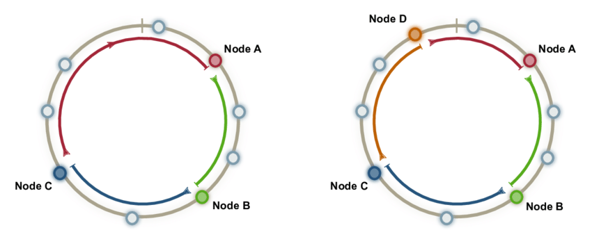
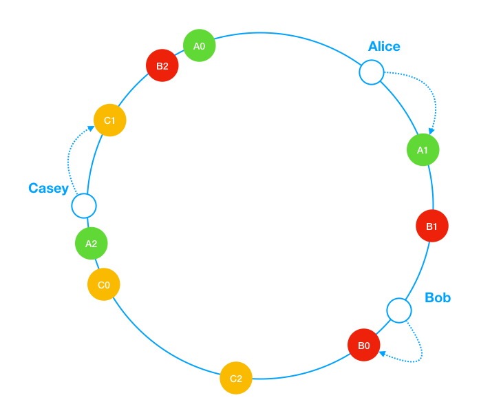
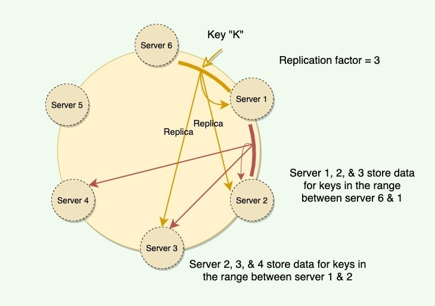

# 안정 해시

### 해시 키 재비치(rehash) 문제

- 보편적인 해시 함수 : `serverIndex = hash(key) % N` (N은 서버 개수)
- 서버의 개수가 바뀌면 serverIndex를 모두 다시 계산 ⇒ 대규모 캐시 미스가 발생

## 안정 해시(consistant hash)

- 해시 함수로 SHA-1를 사용한다고 가정하면 총 해시 공간은 0~$2^{160}$-1
- 서버 : 서버의 고유한 값(IP, 이름 등)을 해싱해서 이 공간 어딘가에 배치한다.
- 키 : 키를 해싱해서 이 공간 어딘가에 배치한다.
- 해시 공간의 앞 뒤를 이어붙이면 아래 그림처럼 된다.
- 그리고 모든 키값은 자기 바로 다음에 나오는 서버(노드)에 할당된다.

- 서버 추가 : 오른쪽 그림과 같이 주황색 서버가 추가되면 파랑과 주황 사이의 키값들만 재배치된다.
- 서버 제거 : 주황색 서버가 제거된다면, 주황색 서버에 배치된 키들만 재배치된다.

### 문제점

- 파티션(서버 사이의 해시 공간)이 균일하지 않다.
  - 서버를 추가 또는 삭제할 경우 파티션의 크기가 급격하게 달라진다.
- 키값이 균등하게 분포하지 않는다.

⇒ 가상 노드 또는 복제 기법을 사용해 해결한다.

## 가상 노드

하나의 서버를 여러 해시 공간에 가상으로 두는 방법이다. 

- 가상 노드의 개수가 많아질 수록 표준 편차가 줄어들어 키의 분포는 점점 균등해진다.
- SHA-1에서 가상 노드가 200개 일 때 표준 편차가 평균의 5%로 제일 낮았다.
- 재배치 방법은 안정 해시와 비슷하게 가상 노드 사이의 키들만 재배치한다.
- 표준 편차와 노드의 저장 공간 사이의 트레이드 오프가 필요하다.

## 장점

- 재배치되는 키의 수가 최소화된다.
- 데이터가 균등하게 분포하므로 수평적 규모 확장에 용이하다.
- 특정 노드(샤드)에 접근이 몰리는 핫스팟 문제를 줄일 수 있다.

### 용례

- AWS DynamoDB 파티셔닝 관련 컴포넌트
- Apache Cassandra 클러스터의 데이터 파티셔닝
- 디스코드 채팅 앱

## 추가

데이터를 여러 대의 노드에 저장하는 방법이다. 키의 위치 다음 N개의 노드에 데이터를 저장한다.

