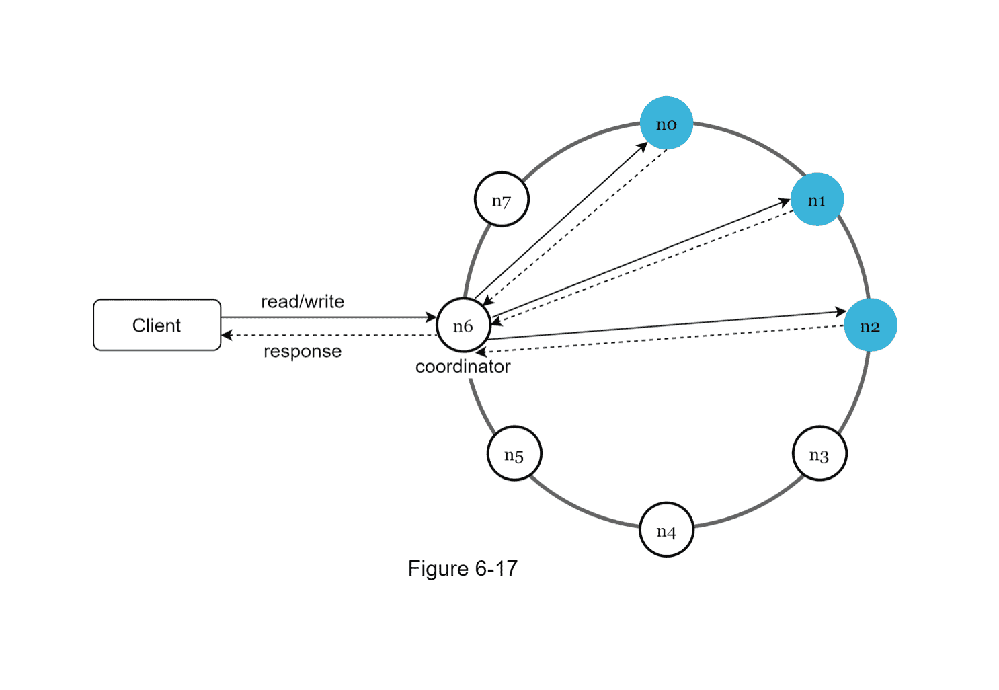
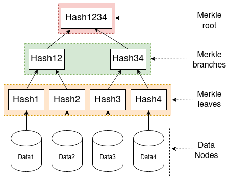
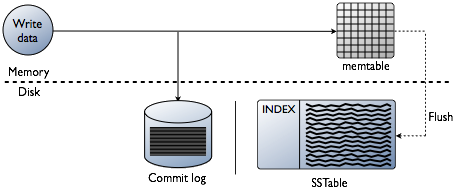

# 키-값 저장소

- **목차**

key-value store는 고유한 key값을 통해 값을 찾는 NoSQL 데이터베이스이다.

- 키는 일반 텍스트일 수도 있고 해시 값일 수도 있다. (포인터 주소를 쓰면 객체도 가능)
- 키가 짧을 수록 성능이 좋다.
- 값은 보통 무엇이든 올 수 있다.

우리는 `put(key, value)`와 `get(key)`를 구현한다.

### 단일 키-값 저장소

키-값 페어 전부를 메모리에 해시 테이블로 저장하는 방법을 쓰는 것이 가장 쉽다. 하지만 메모리가 쉽게 고갈되기 때문에 아래 개선책을 고려한다.

- 데이터 압축
- 자주 쓰이는 데이터만 메모리에 남기고 나머지는 디스크에 저장
- 분산 키-값 저장소로 여러 개의 메모리 쓰기

## CAP

- **일관성** (**C**onsistency) : 클라이언트는 어떤 노드에 접근했는지 상관없이 같은 데이터를 봐야 한다.
- **가용성** (**A**vailability) : 일부 노드에 장애가 발생하더라도 항상 응답할 수 있어야 한다.
- **파티션 감내** (**P**artition tolerance) :  파티션(네트워크에 장애)이 생기더라도 시스템은 동작해야 한다.

CAP 정리란 `세 가지 요구사항 중 오로지 두 가지만 만족할 수 있다`는 것을 의미한다.

- 충족하는 요구사항에 따라 CP, AP, CA 시스템이라 한다.
- 단, 네트워크 장애는 무시하면 안되므로 실세계에서 CA는 성립하지 않는다.

## 다중화와 일관성

### 데이터 파티션

데이터를 작은 단위로 나누어서 여러 대의 서버에 저장한다. 이는 [안정 해시](https://www.notion.so/9cc24771624e472db3e46c784f74628a)에서 다루었다. 장점은 다음과 같다.

- Automatic scaling : 서버를 자동으로 추가/제거할 수 있다.
- 다양성(heterogeneity) : 고성능 서버는 더 많은 가상 노드를 할당하는 방식으로 조절할 수 있다.

### 데이터 다중화

- 데이터 유실을 방지하기 위해 데이터를 N 대의 서버에 비동기적으로 복제한다.
- 안정 해시를 응용해서 바로 다음 노드 뿐만이 아니라 다음 N개의 노드에 데이터를 저장한다.
- 가상 노드를 쓰면 실질적으로 N대의 서버에 저장되지 않을 수 있기 때문에 조율해야 한다.
- 고속 연결망이 구축된 다른 데이터 센터에 데이터 사본을 보관한다.

### 데이터 일관성

읽기 쓰기의 일관성을 보장하기 위해 **정족수 합의**(Quorum Consensus) 프로토콜을 사용한다.

- N : 데이터 사본 개수
- W : 쓰기 연산의 정족수. W 개 노드가 쓰기를 성공했다고 알려야 한다
- R : 읽기 연산의 정족수. R 개 노드가 읽기를 성공했다고 알려야 한다

중재자(coordinator)는 클라이언트의 읽기/쓰기 요청을 전파하고 성공 여부를 판단한다.

- R=1, W=N : 빠른 읽기
- W=1, R=N : 빠른 쓰기
- W + R > N : 강한 일관성 (보통 N=3, W=R=2)

### 일관성 모델

- 강한 일관성 : 모든 읽기 연산은 가장 최근에 갱신된 결과만 반환한다.
- 약한 일관성 : 읽기 연산은 가장 최근에 갱신된 결과를 반환하지 못 할 수도 있다.
- 최종 일관성 : 약한 일관성의 한 형태로, 시간이 지나면 모든 사본이 갱신된다.

⇒ 강한 일관성을 구현하려면 갱신이 끝날 때까지 모든 읽기/쓰기 연산을 금지해야 하기 때문에 부적합하다.

⇒ 대부분 최종 일관성 모델을 채택하고, 클라이언트에서 일관성이 깨진 데이터를 읽지 않도록 조치한다.

### 비 일관성 해소 기법 : 데이터 버저닝

[데이터 다중화](https://www.notion.so/9133838f22584d8bb7d1e6bae30cbd86) 를 달성하기 위해 같은 데이터를 여러 대의 노드에 저장한다. 그렇다면 클라이언트가 동시에 두 대의 노드로 put 명령을 보내면 어떻게 될까? 단순한 구조에서는 일관성이 깨지게 된다. 이 문제를 `버저닝`과 `벡터 시계`(vector clock)으로 해결한다.

- 벡터 시계 = [서버, 버전] 순서쌍
- 모든 노드는 하나의 데이터당 벡터 시계 $D([S_1, v_1],\,\cdots, [S_n, v_n])$를 가진다.
    - **D** : 하나의 데이터에 대한 일종의 메타데이터
    - **S** : D에 쓰기 연산을 수행한 서버. 모든 S는 고유하다.
    - **v** : 한 서버가 여러 번의 쓰기 연산을 수행할 때 증가시키는 버전
- 같은 데이터의 벡터 시계가 노드끼리 다르다면, 노드(S)별 가장 최신의 버전(v)을 합해놓은 새로운 벡터 시계를 만든다.

**단점**

- 충돌 감지 및 해소 로직이 클라이언트에 들어가 있어 구현이 복잡해진다.
- 오래된 [서버, 버전] 순서쌍을 제거하지 않으면 너무 많은 데이터가 저장된다.
    - 이렇게 하면 버전 간 선후 관계를 100% 확정할 수 없어 충돌 해소의 효율성이 낮아진다.
    - 하지만 DynamoDB에서는 아직 이 문제가 발생하지 않았다.

## 장애처리

### 장애 감지

분산 시스템에서는 두 대 이상의 서버가 특정 서버의 장애를 보고해야 실제로 장애가 났다고 판단한다. 이를 해결하기 위해 모든 노드 사이에 멀티캐스팅 채널을 구축하는 것이 가장 쉽지만 비용적으로 부담이 크다. 따라서 **가십 프로토콜(gossip protocol)** 같은 분산형 장애 감지 솔루션을 사용한다.

### 가십 프로토콜

모든 노드끼리 연결하지 않고 적당히만 연결한다. 그런 후 자신의 상태를 몇 개의 노드에게 전파한다. 전파 받은 노드는 자신과 연결된 다른 노드에 이 정보를 전파한다. 그렇게 모든 노드가 서로의 상태를 알게된다.

- 모든 노드는 `맴버 ID`, `heartbeat counter`로 구성된 membership 목록을 가진다.
- 모든 노드는 자신의 상태를 전파하고 다른 노드들의 상태도 열심히 전파한다.
- 어떤 맴버의 heartbeat counter가 일정 시간 이상 갱신되지 않으면 장애가 발생했다고 판단한다.

### 일시적 장애 처리

가십 프로토콜로 장애를 감지했다면, [데이터 일관성](https://www.notion.so/5d3704d6e0b449e5be657557dfa383cf)의 정족수 합의를 사용해 해결한다.

- **엄격한 정족수** : 읽기와 쓰기 연산을 금지하고 장애를 처리한다.
- **느슨한 정족수**
    - 장애 상태의 서버를 제외하고 W개의 쓰기 연산 서버, R개의 읽기 연산 서버를 선택한다.
    - 중재자는 장애 서버로 가는 요청을 다른 서버들로 보내서 처리한다.
    - 이 동안의 변경사항은 서버를 복구하면 일괄 반영한다.
    - 이를 위해 임시 쓰기 연산 서버에 단서(hint)를 남긴다. 이를 `hinted handoff`라고 한다.

### 영구 장애 처리 : 안티 엔트로피 프로토콜

- 안티 엔트로피 프로토콜 : 사본의 망가진 상태를 탐지하고 갱신하는 프로토콜
- **해시 트리(merkle tree)**를 이용해 탐색 속도를 빠르게 함
- Data Nodes : 모든 노드의 데이터는 적절한 파티션으로 나누어서 저장
- 각 데이터의 해시를 트리 형태로 올리기 때문에 트리의 루트부터 값을 비교하면 어디서 데이터가 불일치하는지 쉽게 찾아낼 수 있음

### 데이터 센터 장애 처리

여러 데이터 센터에 다중화하자

## 시스템 아키텍처 다이어그램

**지원하는 기능**

- get, put API를 지원
- 중재자는 클라이언트와 저장소 사이의 프록시 역할을 하는 노드
- 노드는 안정 해시의 해시 링 위에 분포
- 시스템을 완전 분산해 노드를 자동으로 추가 및 제거 가능
- 데이터는 여러 노드에 다중화
- 모든 노드가 같은 책임을 지므로 SPOF가 발생하지 않음

### 쓰기 경로

카산드라의 쓰기 경로

1. 쓰기 요청이 커밋 로그에 기록된다.
2. 데이터가 메모리 캐시에 저장된다.
3. 메모리 캐시가 임계치에 도달하면 데이터를 디스크에 있는 SSTable(Sorted-String)에 기록한다.

### 읽기 경로

1. 메모리를 캐시를 살피고 있으면 값을 반환한다.
2. 없으면 Bloom filter를 통해 어느 SSTable에 값이 있는지 검색하고 값을 반환한다.